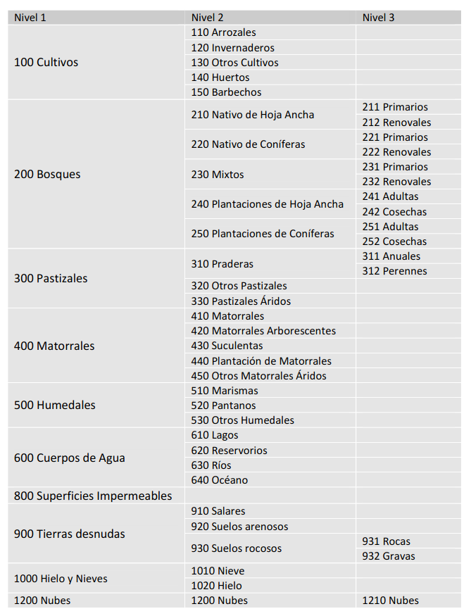

```{r setup, include=FALSE}
knitr::opts_chunk$set(echo = FALSE)
Codes <- read.csv("Codes.csv")
```

# Este repositorio es para generar una capa de uso de suelo discreta

Simplemente para tomar el raster que se puede descargar en el siguiente [link](http://www.gep.uchile.cl/Landcover/LandCover%20CHILE%202014.zip), en el cual se encuentra una capa de uso de suelo de chile de 30x30 metros, generado en el paper de Zhao et al. 2016. El raster es numérico pero los códigos de cada uso de suelo son los siguientes:

```{r}

```

Esto fue transformado en un csv tidy, que se encuentra en este repositorio `Codes.csv`, el cual es conveniente para transformar el raster en un raster categórico. Después de las referecias se puede visualizar el csv, en el cuál las categorías se encuentran tanto en español como en inglés

# Referencias 

Zhao, Y.; Feng, D.,  Yua, L., Wang, X.,  Chen, Y., Hernández, H.J., Galleguillos, M., Estades, C., Biging, G., Radke, J. & Gong, P. 2016. Detailed dynamic land cover mapping of Chile: accuracy improvement by integrating multi-seasonal land cover data. Remote Sensing of Environment 183, 170–185. doi:10.1016/j.rse.2016.05.016


## Tabla csv

```{r}
knitr::kable(Codes)
```

