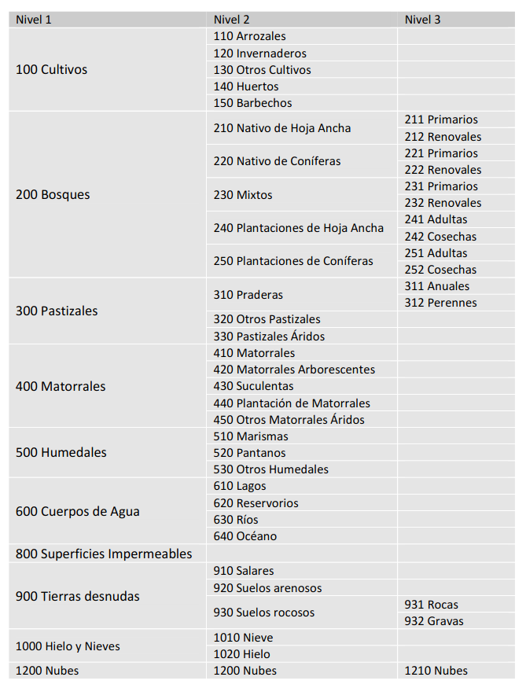

Usos de suelo de Chile
================

# Este repositorio es para generar una capa de uso de suelo discreta

Simplemente para tomar el raster que se puede descargar en el siguiente
[link](http://www.gep.uchile.cl/Landcover/LandCover%20CHILE%202014.zip),
en el cual se encuentra una capa de uso de suelo de chile de 30x30
metros, generado en el paper de Zhao et al. 2016. El raster es numérico
pero los códigos de cada uso de suelo son los siguientes:

Esto fue transformado en un csv tidy, que se encuentra en este
repositorio `Codes.csv`, el cual es conveniente para transformar el
raster en un raster categórico. Después de las referecias se puede
visualizar el csv, en el cuál las categorías se encuentran tanto en
español como en inglés

# Referencias

Zhao, Y.; Feng, D., Yua, L., Wang, X., Chen, Y., Hernández, H.J.,
Galleguillos, M., Estades, C., Biging, G., Radke, J. & Gong, P. 2016.
Detailed dynamic land cover mapping of Chile: accuracy improvement by
integrating multi-seasonal land cover data. Remote Sensing of
Environment 183, 170–185.
<doi:10.1016/j.rse.2016.05.016>

## Tabla csv

| Code | Secondary                           | Primary                  | Secondary.\_English         | Primary\_English |
| ---: | :---------------------------------- | :----------------------- | :-------------------------- | :--------------- |
|  110 | Arrozal                             | Cultivos                 | Rice paddy                  | Crops            |
|  120 | Invernaderos                        | Cultivos                 | greenhouses                 | Crops            |
|  130 | Otros Cultivos                      | Cultivos                 | other Crops                 | Crops            |
|  140 | Huertos                             | Cultivos                 | vegetable gardens           | Crops            |
|  150 | Barbechos                           | Cultivos                 | fallows                     | Crops            |
|  211 | Nativo de Hoja Ancha primario       | Bosques                  | Native Broad Leaf primary   | forests          |
|  212 | Nativo de Hoja Ancha renoval        | Bosques                  | Native Broadleaf renoval    | forests          |
|  221 | Nativo de Conifera primario         | Bosques                  | Conifera native primary     | forests          |
|  222 | Nativo de Conifera renoval          | Bosques                  | Conifera native renoval     | forests          |
|  231 | Mixto primario                      | Bosques                  | Primary mixed               | forests          |
|  232 | Mixto renoval                       | Bosques                  | mixed renoval               | forests          |
|  241 | Plantaciones de Hoja Ancha Adulta   | Bosques                  | Adult plantations Broadleaf | forests          |
|  242 | Plantaciones de hoja Ancha cosechas | Bosques                  | Broadleaf plantation crops  | forests          |
|  251 | Plantaciones de Coníferas adultas   | Bosques                  | Adult conifer plantations   | forests          |
|  252 | Plantaciones de coníferas cosechas  | Bosques                  | Conifer plantations crops   | forests          |
|  311 | Praderas anuales                    | Pastizales               | grasslands annual           | grasslands       |
|  312 | Praderas perennes                   | Pastizales               | perennial grasslands        | grasslands       |
|  320 | Otros Pastizales                    | Pastizales               | other Grasslands            | grasslands       |
|  330 | Pastizales Áridos                   | Pastizales               | grasslands Áridos           | grasslands       |
|  410 | Matorral                            | Matorral                 | Scrub                       | Scrub            |
|  420 | Matorral Arborescentes              | Matorral                 | scrubland Arborescent       | Scrub            |
|  430 | Suculentas                          | Matorral                 | succulents                  | Scrub            |
|  440 | Plantación de Matorral              | Matorral                 | Planting Thicket            | Scrub            |
|  450 | Otros Matorrales Áridos             | Matorral                 | Other scrubby               | Scrub            |
|  510 | Marismas                            | Humedales                | marshes                     | wetlands         |
|  520 | Pantanos                            | Humedales                | marshes                     | wetlands         |
|  530 | Otros humedales                     | Humedales                | other wetlands              | wetlands         |
|  610 | Lagos                               | Cuerpos de agua          | Lagos                       | Water bodies     |
|  620 | Reservorios                         | Cuerpos de agua          | reservoirs                  | Water bodies     |
|  630 | Ríos                                | Cuerpos de agua          | Rivers                      | Water bodies     |
|  640 | Océano                              | Cuerpos de agua          | Ocean                       | Water bodies     |
|  800 | Superficies Impermeables            | Superficies Impermeables | Paved surface               | Paved surface    |
|  910 | Salares                             | Tierras desnudas         | Salares                     | bare land        |
|  920 | Suelos arenosos                     | Tierras desnudas         | sandy soils                 | bare land        |
|  931 | Suelos rocosos rocas                | Tierras desnudas         | Rocks rocky soils           | bare land        |
|  932 | Suelos rocosos gravas               | Tierras desnudas         | Rocky soil gravels          | bare land        |
| 1010 | Nieve                               | Hielo y Nieves           | Snow                        | Ice and Snow     |
| 1020 | Hielo                               | Hielo y Nieves           | Ice                         | Ice and Snow     |
| 1210 | Nubes                               | Nubes                    | clouds                      | clouds           |
